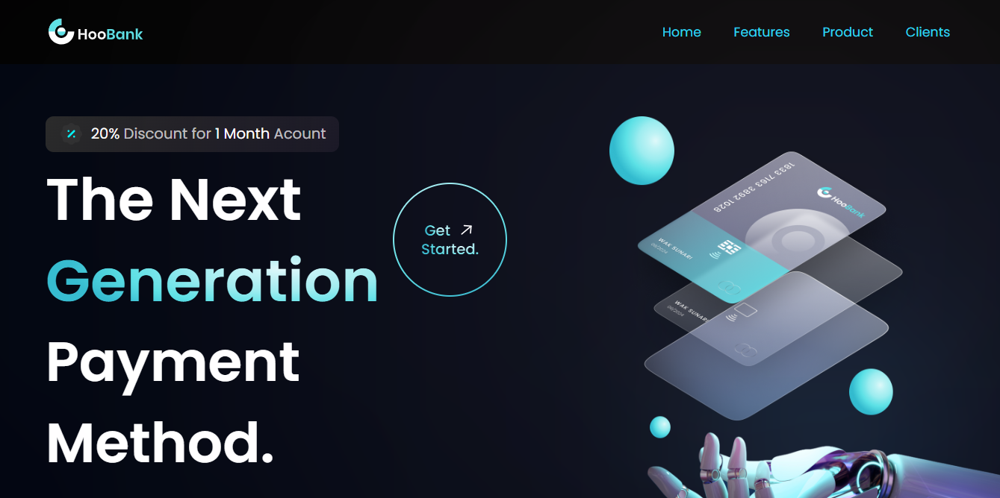

<<<<<<< HEAD
# Modern Bank Landing page UI/UX Design Using  React + Vite And TailwindCSS


=======
This project is a **modern, responsive, and user-friendly** bank landing page built using **React, Vite, and TailwindCSS**. The design focuses on **clean UI, smooth user experience, and accessibility** while ensuring fast performance with Vite’s optimized development workflow.  

## ✨ Features  

- **Fully Responsive** – Optimized for desktop, tablet, and mobile views.  
- **Modern UI/UX** – Sleek and intuitive design for a seamless banking experience.  
- **Fast Performance** – Powered by Vite for quick load times and efficient bundling.  
- **TailwindCSS Styling** – Utility-first CSS framework for easy customization.  
- **Reusable Components** – Well-structured and modular React components.  

## 🚀 Technologies Used  

- **React** – Component-based UI development.  
- **Vite** – Fast and optimized build tool.  
- **TailwindCSS** – Utility-first CSS framework for styling.  

## 📷 Preview  

 


## 📦 Getting Started  

1. Clone the repository:  
   ```sh
   git clone https://github.com/ben-bader/Bank-Modern-APP.git
   ```
2. Navigate to the project directory:  
   ```sh
   cd Bank-Modern-APP
   ```
3. Install dependencies:  
   ```sh
   npm install
   ```
4. Start the development server:  
   ```sh
   npm run dev
   ```  
5. Open **http://localhost:5173/** in your browser to view the project.  

## 🛠️ Customization  

You can easily customize colors, fonts, and layouts by modifying the **TailwindCSS configuration** and component structure.  

## 💡 Contributing  

Feel free to contribute by submitting pull requests or opening issues for bug fixes and feature improvements.  

## 📜 License  

This project is licensed under the **MIT License** – you are free to use, modify, and distribute it.  
>>>>>>> 2937f98 (Updated README with project description and added an image)


